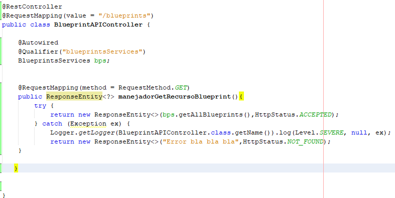
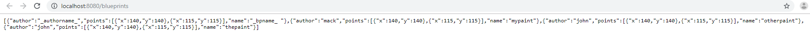
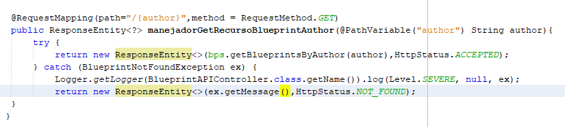
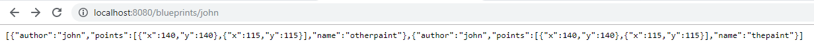
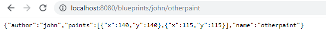

# Blueprint Management 2

## PART I
* 	Integrate to the base project supplied the Beans developed in the previous exercise. Just copy the classes, NOT the configuration files. Rectify that the dependency injection scheme is correctly configured with the @Service and @Autowired annotations.
* 	Modify the persistence bean InMemoryBlueprintPersistence so that by default it is initialized with at least three other planes, and with two associated with the same author.

	

* 	Configure your application to offer the resource /blueprints, so that when a GET request is made, return in JSON format - all the drawings. For this:
	*	Modify the BlueprintAPIController class taking into account the following example of a REST controller made with SpringMVC/SpringBoot
	*	Have the BlueprintServices type bean injected into this class (which, in turn, will be injected with its persistence and point filtering dependencies).
	
	

*	Verify the operation of the application by launching the application with maven. And then sending a GET request to: http://localhost:8080/blueprints. Rectify that, in response, a JSON object is obtained with a list containing the detail of the drawings provided by default, and that the corresponding point filtering has been applied.

	

*	Modify the controller so that it now accepts GET requests to the resource /blueprints/{author}, which returns using a JSON representation all the plans made by the author whose name is {author}. If there is no such author, you must respond with the HTTP error code 404. For this, review in the Spring documentation, section 22.3.2, the use of @PathVariable. Again, verify that when making a GET request -for example- to the resource http://localhost:8080/blueprints/juan, the set of planes associated with the author 'juan' is obtained in JSON format (adjust this to the names of author used in point 2).

	
	
	

* 	Modify the controller so that it now accepts GET requests to the resource/blueprints/{author}/{bpname}, which returns using a JSON representation only ONE plane, in this case the one made by {author} and whose name is {bpname}. Again, if there is no such author, you must respond with the HTTP 404 error code.

	
	
	

## PART II
*	Add the handling of POST requests (creation of new plans), so that an http client can register a new order by making a POST request to the resource planes, and sending as content of the request all the detail of said resource through a JSON document. For this, consider the following example, which considers - by consistency with the HTTP protocol - the handling of HTTP status codes (in case of success or error):
*	To test that the planes resource correctly accepts and interprets POST requests, use the Unix curl command. This command has as a parameter the type of content handled (in this case JSON), and the message body that will go with the request, which in this case must be a JSON document equivalent to the Client class (where instead of {JSON Object}, a JSON object corresponding to a new order will be used.
*	With the above, register a new plane (to 'design' a JSON object, you can use this tool). It can be based on the JSON format shown in the browser when consulting an order with the GET method.
*	Taking into account the author and name of the registered plan, verify that it can be obtained through a GET request to the corresponding resource /blueprints/{author}/{bpname}.
*	Add support to the PUT verb for resources of the form /blueprints/{author}/{bpname}, so that it is possible to update a specific plane.
## PART III
The BlueprintsRESTAPI component will work in a concurrent environment. That is, it will attend multiple requests simultaneously (with the stack of applications used, these requests will be attended by default across multiple threads). Given the above, you should review your API (once it works), and identify:
*	What race conditions could occur? 
* 	What are the respective critical regions? 
Set the code to suppress race conditions. Keep in mind that simply synchronizing access to persistence/query operations will significantly degrade the API performance, so you should look for alternative strategies.
Write your analysis and the solution applied to the file README.txt
